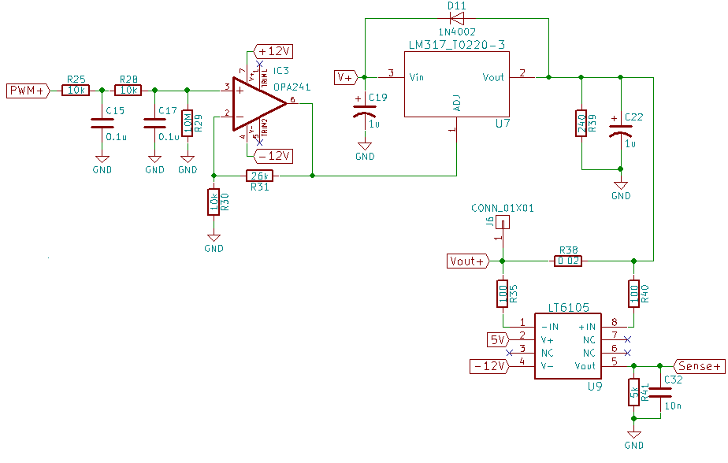

# power_supply_mk1

## Description

Power supply created during ELE3000 - Personal project at Polytechnique Montreal (2017).  
The voltage is controlled by a PWM signal generated by a EFM8 Silicon Labs microcontroller. The signal is filtered and injected into the adjust pin of a LM337 and LM317 to generate a variable positive and negative voltage (got the idea from the EEVBlog#221 https://www.youtube.com/watch?v=CIGjActDeoM&t=860s). 

To communicate with the microcontroller, I used an Aardvark (USB to I2C Host Adapter). The voltage was set and the current was measured in real-time. Everything was displayed on a GUI made with PyQt.

## Project Details

TODO: Translate to english.

### Circuit Design

The PCB was designed using KiCAD. The KiCAD project can be found in the ./kicad_psu_mk1 directory.  
NOTE: This was one of my first PCB designs. I tried using many through-hole components to test them on a breadboard.

#### Schematic

#### PCB

#### Rectifier Bridge

A simple diode bridge was used to rectify the voltage coming out of the transformer.

#### Microcontroller

The EFM8BB1 microcontroller was used for this project. I chose this MCU since I had a couple laying around. A laptop communicates with the chip via I2C (and a USB to I2C adapter). I2C was used since it's a simple protocol that be used with a Raspberry Pi. The MCU also sends a PWM signal to the voltage regulators to modulate the output voltage.
2 ADCs are used to measure the voltage drop across a very small resistor to detect the current flowing through the outputs.

#### Positive voltage control

The voltage is controlled with a PWM signal which is filtered and amplified. An LM317 is used for the positive voltage and a LM337 is used for the negative voltage.

### GUI

The python GUI used is illustrated below. The voltage could be set and read in real-time. The code can be found in ./python_code. However, the hc file is not included (Aardvark interface), PyQt4 is no longer supported and the code runs in Python2. 

### Final Result

Overall, the PSU could provide upto 1.5 A of current at +/-2V to +/- 12.5V. The final circuit looked like this:

